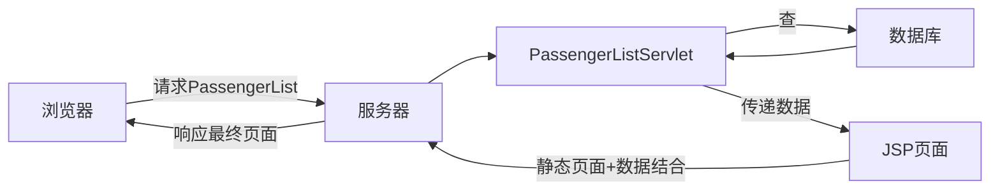

1. `PassengerListServlet`

`src/com/oracle/servlets/PassengerListServlet.java`

从数据库获取当前用户下的旅客

```java
package com.oracle.servlets;

import com.oracle.mapper.PassengerMapper;
import com.oracle.model.Passenger;
import com.oracle.model.User;
import com.oracle.util.MybatisUtil;
import org.apache.ibatis.session.SqlSession;

import javax.servlet.Servlet;
import javax.servlet.ServletException;
import javax.servlet.annotation.WebServlet;
import javax.servlet.http.HttpServlet;
import javax.servlet.http.HttpServletRequest;
import javax.servlet.http.HttpServletResponse;
import java.io.IOException;
import java.io.PrintWriter;
import java.util.List;


@WebServlet("/page/static/user/plist")
public class PassengerListServlet extends HttpServlet {
    @Override
    protected void doGet(HttpServletRequest req, HttpServletResponse resp) throws ServletException, IOException {
        // 获取当前的用户名
        User user = (User) req.getSession().getAttribute("user");
        String username = user.getUsername();

        // 连接数据库
        SqlSession ss = MybatisUtil.createSqlSession();
        PassengerMapper mapper = ss.getMapper(PassengerMapper.class);
        List<Passenger> plist = mapper.findPassengerByUsername(username);

        // Servlet 转发 JSP
        req.setAttribute("plist", plist);
        req.getRequestDispatcher("/page/static/user/changlvke.jsp").forward(req, resp);
    }
}
```

添加旅客

```java
package com.oracle.servlets;

import com.oracle.mapper.PassengerMapper;
import com.oracle.model.Passenger;
import com.oracle.model.User;
import com.oracle.util.MybatisUtil;
import org.apache.ibatis.session.SqlSession;

import javax.servlet.ServletException;
import javax.servlet.annotation.WebServlet;
import javax.servlet.http.HttpServlet;
import javax.servlet.http.HttpServletRequest;
import javax.servlet.http.HttpServletResponse;
import java.io.IOException;

@WebServlet("/padd")
public class PassengerAddServlet extends HttpServlet {
    @Override
    protected void doGet(HttpServletRequest req, HttpServletResponse resp) throws ServletException, IOException {
        String pname = req.getParameter("pname");
        int cardnum = Integer.parseInt(req.getParameter("cardnum"));
        String phone = req.getParameter("phone");
        User user = (User) req.getSession().getAttribute("user");
        String username = user.getUsername();

        Passenger p = new Passenger(pname, cardnum, phone, username);

        SqlSession ss = MybatisUtil.createSqlSession();
        PassengerMapper mapper = ss.getMapper(PassengerMapper.class);
        mapper.addPassenger(p);

        resp.sendRedirect("/air/plist");
    }
}
```

删除旅客

```java
package com.oracle.servlets;

import com.oracle.mapper.PassengerMapper;
import com.oracle.util.MybatisUtil;
import org.apache.ibatis.session.SqlSession;

import javax.servlet.ServletException;
import javax.servlet.annotation.WebServlet;
import javax.servlet.http.HttpServlet;
import javax.servlet.http.HttpServletRequest;
import javax.servlet.http.HttpServletResponse;
import java.io.IOException;

@WebServlet("/pdelete")
public class PassengerDelServlet extends HttpServlet {
    @Override
    protected void doGet(HttpServletRequest req, HttpServletResponse resp) throws ServletException, IOException {
        int pid = Integer.parseInt(req.getParameter("pid"));
        SqlSession ss = MybatisUtil.createSqlSession();
        PassengerMapper mapper = ss.getMapper(PassengerMapper.class);
        mapper.delPassengerByPid(pid);

        resp.sendRedirect("/air/plist");
    }
}
```

2. 渲染 passenger list 

`web/page/static/user/changlvke.jsp`


`<%@ taglib prefix="c" uri="http://java.sun.com/jsp/jstl/core" %>`

`<c:forEach items="${plist}" var="p">` 

```jsp
<%@ page contentType="text/html;charset=UTF-8" language="java" %>
<%@ taglib prefix="c" uri="http://java.sun.com/jsp/jstl/core" %>

...

<!--表格开始-->
<div class="table">
    <!--表格操作-->
    <div class="table-operate ue-clear">
        <a href="/air/page/static/user/addlvke.html" class="add">添加</a>
    </div>
    <!--表格具体内容-->
    <div class="table-box">
        <table>
            <thead>
                <tr>
                    <th>姓名</th>
                    <th>证件号码</th>
                    <th>手机号码</th>
                    <th>操作</th>
                </tr>
            </thead>
            <tbody>
                <c:forEach items="${plist}" var="p">
                    <tr>
                        <td>${p.pname}</td>
                        <td>${p.cardnum}</td>
                        <td>${p.phone}</td>
                        <td><a href="/air/pdelete?pid=${p.pid}">删除</a></td>
                    </tr>
                </c:forEach>
            </tbody>
        </table>
    </div>
</div><!--表格结束-->
```

3. 添加乘客

`/air/page/static/user/addlvke.html`

```html
<form class="saper-form" action="/air/padd">
    <div class="kv-item clearfix">
        <label>旅客姓名：</label>
        <div class="kv-item-content">
            <input type="text" name="pname" placeholder="请输入旅客姓名">
        </div>
    </div>

    <div class="kv-item clearfix">
        <label>身份证号：</label>
        <div class="kv-item-content">
            <input type="text" name="cardnum" placeholder="身份证号码">
        </div>
    </div>

    <div class="kv-item clearfix">
        <label>短信内容：</label>
        <div class="kv-item-content">
            <input type="text" name="phone" placeholder="手机号码">
        </div>
        <div class="kv-item-tip">请正确填写11位手机号码</div>
    </div>

    <div class="kv-item clearfix">
        <label></label>
        <div class="kv-item-content">
            <input type="submit" class="sapar-btn sapar-btn-recom query-btn" value="提交">
            <a href="javascript:history.back(-1)" class="a-btn">返回 </a>
        </div>
    </div>


</form>
```

4. 集成到index

`web/page/static/user/index.html`

```html
<li class="gongwen current"><div class="nav-header"><a href="javascript:;" data-src="/air/plist" class="clearfix"><span>常旅客管理</span><i class="icon"></i></a></div></li>
...
<iframe src="/air/plist" id="iframe" width="100%" height="100%" frameborder="0"></iframe>
```

